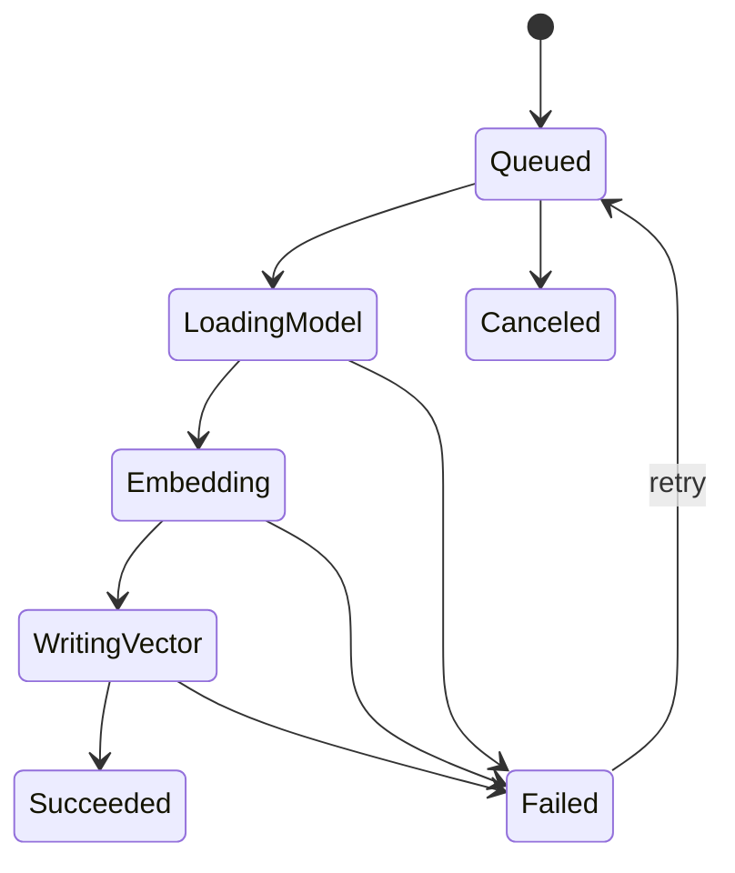

# RFC-008: Embedding Model and Vector Storage

**Project:** orbok  
**RFC:** 008  
**Title:** Embedding Model and Vector Storage  
**Status:** Implemented (v0.3.0)
**Target Milestone:** M7  
**Date:** 2026-06-06  

---

## 1. Summary

This RFC defines the local embedding pipeline and vector storage strategy for `orbok`.

The recommended initial decision is:

> Implement local embedding generation behind a model/backend abstraction, store embeddings as rebuildable index data, start with exact vector search for MVP, and defer advanced ANN/quantization until benchmark evidence justifies it.

`localcache` may be used to cache per-file or per-chunk embedding bundles, but it must not replace the global vector search index.

---

## 2. Motivation

Semantic search is a core product feature. It allows users to find documents by meaning rather than exact words.

However, embeddings introduce important design risks:

- model files are large;
- inference can be slow;
- vectors consume disk space;
- vector format affects search precision;
- model changes invalidate embeddings;
- quantization complicates correctness;
- local CPU-only systems must remain usable.

This RFC provides a practical initial design while preserving future flexibility.

---

## 3. Goals

- Generate embeddings locally.
- Track embedding model/version compatibility.
- Store embeddings as rebuildable index data.
- Support vector similarity search.
- Avoid document upload.
- Allow future backend/model changes.
- Allow future quantization.
- Integrate with localcache for rebuild acceleration.
- Keep keyword-only mode functional if model is missing.

---

## 4. Non-Goals

- This RFC does not choose a final production embedding model.
- This RFC does not require ANN in v1.
- This RFC does not require vector quantization in v1.
- This RFC does not implement reranking.
- This RFC does not define model installation UX.
- This RFC does not define Japanese search quality.

---

## 5. Embedding Model Requirements

An embedding model candidate should be evaluated by:

- local inference feasibility;
- multilingual/Japanese capability;
- model size;
- embedding dimension;
- license;
- CPU performance;
- GPU support;
- accuracy on mixed local documents;
- compatibility with Rust inference backend.

The default model should not be hardcoded deeply into architecture.

---

## 6. Backend Abstraction

Recommended interface:

```rust
pub trait EmbeddingBackend {
    fn backend_name(&self) -> &'static str;
    fn load_model(&self, model: &ModelRecord) -> Result<Box<dyn EmbeddingModel>>;
}

pub trait EmbeddingModel {
    fn model_id(&self) -> ModelId;
    fn dimension(&self) -> usize;
    fn embed_batch(&self, inputs: &[EmbeddingInput]) -> Result<Vec<EmbeddingVector>>;
}
```

Backend candidates:

- `candle`;
- ONNX Runtime;
- CPU-only fallback;
- CUDA/Metal support later.

The app should prefer Rust-native inference where practical but should not make model execution unreplaceable.

---

## 7. Embedding Input Construction

Embedding text should be deterministic and versioned.

Recommended format:

```text
Title: <title if any>
Section: <heading path if any>
Text:
<chunk text>
```

Version:

```text
embedding_text_builder_version = "embed-text-v1"
```

Changing the text builder version invalidates embeddings.

---

## 8. Model Registry

RFC-002 already defines `models`.

Embedding model fields:

```text
model_id
role = embedding
model_name
model_version
model_family
local_path
license_summary
size_bytes
backend
dimension
status
last_validated_at
```

Changing active embedding model must mark previous embeddings incompatible or stale.

---

## 9. Embedding Records

RFC-002 defines:

```sql
embeddings
```

Key rules:

- Embeddings are rebuildable.
- Each embedding is tied to:
  - chunk_id;
  - model_id;
  - vector_format;
  - dimension;
  - norm;
  - status.
- A chunk may have multiple embeddings for different models/formats during migration.

---

## 10. Vector Format

Initial recommended format:

```text
fp32
```

Reason:

- easiest to implement;
- easiest to validate;
- avoids early quantization debugging;
- preserves retrieval quality baseline.

Optional later formats:

```text
fp16
int8
binary
```

Quantization should be introduced only after benchmark comparison.

---

## 11. Vector Normalization

Recommended:

```text
L2 normalize embeddings before storage if model/search expects cosine similarity.
```

Store norm field:

```text
l2
none
unknown
```

Vector search must know whether vectors are normalized.

---

## 12. Vector Storage Options

## 12.1. SQLite BLOB Storage

Pros:

- simple;
- easy transactional behavior;
- good for MVP and small/medium collections.

Cons:

- large database growth;
- slower bulk vector scan;
- less suitable for ANN.

## 12.2. External Segment Files

Pros:

- better for large vector sets;
- can be memory-mapped;
- easier future ANN or segment compaction.

Cons:

- more lifecycle complexity;
- catalog/segment consistency required.

## 12.3. Recommended Initial Strategy

Start with SQLite BLOBs or a simple external segment abstraction depending on expected dataset size.

To avoid architectural lock-in, implement a `VectorStore` trait from the beginning.

---

## 13. VectorStore Abstraction

```rust
pub trait VectorStore {
    fn upsert(&self, record: VectorRecord) -> Result<()>;
    fn delete_by_chunk(&self, chunk_id: &ChunkId) -> Result<()>;
    fn search(&self, query: &[f32], limit: usize) -> Result<Vec<VectorCandidate>>;
    fn mark_stale_by_model(&self, model_id: &ModelId) -> Result<()>;
}
```

## 13.1. VectorCandidate

```rust
pub struct VectorCandidate {
    pub chunk_id: ChunkId,
    pub rank: u32,
    pub similarity: f32,
    pub model_id: ModelId,
}
```

---

## 14. Exact Search MVP

Initial vector search may use exact scan:

```text
query vector
  -> compare with active embeddings for active model
  -> cosine/dot similarity
  -> top K
```

This is acceptable for early versions and helps validate retrieval quality.

ANN can be added later if benchmarks show exact search is insufficient.

---

## 15. Embedding Job Lifecycle



Failure categories:

```text
model_missing
model_invalid
backend_unavailable
out_of_memory
input_too_long
inference_error
write_error
canceled
```

---

## 16. Batch Strategy

Embedding should use batching, but conservative defaults.

Initial defaults:

| Setting | Default |
|---|---:|
| embedding worker count | 1 |
| batch size CPU | 8-16 chunks |
| batch size GPU | backend-dependent |
| max input tokens | model-dependent |
| lazy model loading | yes |

Do not load embedding model at app startup unless needed.

---

## 17. localcache Integration

`localcache` may cache per-file or per-chunk embedding bundles.

Recommended namespace:

```text
embedding-bundle:<model_id>:<vector_format>:v1
```

Recommended change detection:

```text
MetadataThenFullHash
```

Use cases:

- avoid re-embedding unchanged files;
- rebuild vector index after segment compaction;
- migrate vector storage without rerunning model;
- resume interrupted indexing.

Rules:

1. `localcache` is not the vector search engine.
2. Authoritative embedding metadata remains in `orbok` catalog.
3. Global retrieval uses `VectorStore`.
4. Payload version changes when embedding bundle format changes.
5. Namespace includes model ID and vector format.
6. Privacy/storage UI reports embedding cache size.

---

## 18. Model Change Handling

When active embedding model changes:

1. mark old embeddings stale or incompatible;
2. keep old embeddings only if multi-model support is explicitly enabled;
3. queue re-embedding jobs;
4. warn user that semantic search may be incomplete until rebuild completes.

Changing reranker model does not invalidate embeddings.

---

## 19. Chunk Change Handling

When a chunk becomes stale:

- its embedding becomes stale;
- vector index entry must be excluded from active search;
- new embedding job is queued after rechunking.

---

## 20. Storage Mode Impact

| Mode | Vector Behavior |
|---|---|
| Balanced | fp32/fp16 baseline, moderate cache |
| High Accuracy | full precision, more retained embedding cache |
| Space Saving | quantization when available, smaller cache |
| Privacy Strict | minimize text-bearing caches; embeddings still sensitive local data |

Embeddings should be described as sensitive derived data.

---

## 21. UI Impact

When embedding model is missing:

```text
Semantic search is unavailable.
Keyword search still works.
```

When reembedding is required:

```text
Semantic search index needs rebuild because the embedding model changed.
```

When vector index is deleted:

```text
Semantic search may be unavailable until rebuilt.
```

---

## 22. Security and Privacy

Embeddings can leak semantic information about source documents. Treat them as sensitive local derived data.

Rules:

- do not log vector values;
- do not upload vectors by default;
- allow vector index deletion;
- include vector index in storage dashboard;
- avoid silent model downloads.

---

## 23. Acceptance Criteria

- Embedding backend abstraction exists.
- Model registry records embedding model.
- Chunks can be embedded locally.
- Embeddings are stored as rebuildable index data.
- Vector search returns ranked candidates.
- Keyword-only mode works when model is missing.
- Model change marks embeddings stale/incompatible.
- Chunk change invalidates embeddings.
- localcache embedding bundle is optional and non-authoritative.
- Vector values are not logged.

---

## 24. Testing Requirements

Required tests:

1. Model missing disables semantic search cleanly.
2. Embedding generation succeeds for sample chunks.
3. Vector dimension mismatch is rejected.
4. Stored vector can be retrieved and searched.
5. Model change invalidates old embeddings.
6. Chunk stale status excludes vector from active search.
7. localcache embedding bundle cache miss on model namespace mismatch.
8. Deleted vector index does not delete source catalog.
9. Exact vector search returns expected nearest candidate.
10. Logs do not include vector values.

---

## 25. Unresolved Questions

- Which embedding model should be recommended first?
- Should SQLite BLOB be used for v1 or should external segment files start immediately?
- Should FP16 be introduced early?
- Which runtime backend should be default?
- Should embeddings be encrypted at rest?
- How large a dataset justifies ANN?

---

## 26. Decision

Implement embedding and vector search behind abstractions.

Start with correctness-first local embeddings and exact vector search. Defer ANN and quantization until benchmarks justify them.
