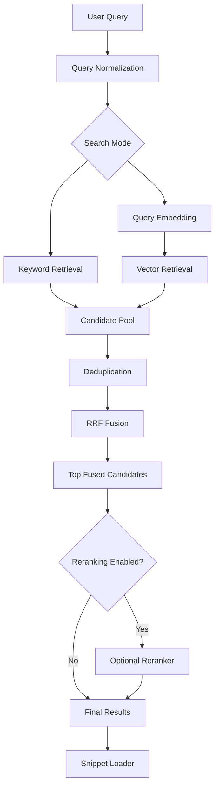

# RFC-009: Hybrid Search and RRF Fusion

**Project:** orbok  
**RFC:** 009  
**Title:** Hybrid Search and RRF Fusion  
**Status:** Implemented (v0.3.0)
**Target Milestone:** M8  
**Date:** 2026-06-06  

---

## 1. Summary

This RFC defines how `orbok` combines keyword search and vector search into a unified result ranking.

The central decision is:

> `orbok` should use Reciprocal Rank Fusion as the initial hybrid ranking method because it is simple, robust, score-scale independent, and appropriate for combining keyword and vector retrieval.

---

## 2. Motivation

Keyword search and vector search have different strengths.

Keyword search is strong for:

- exact names;
- identifiers;
- model numbers;
- code symbols;
- logs;
- file paths;
- explicit terms.

Vector search is strong for:

- conceptual queries;
- paraphrases;
- broad topics;
- natural-language questions;
- semantically related content.

Raw scores from these systems are not directly comparable. RRF solves this by combining ranks rather than raw scores.

---

## 3. Goals

- Combine keyword and vector candidates.
- Avoid losing exact matches.
- Avoid over-trusting vector similarity.
- Deduplicate results.
- Provide result explanation metadata.
- Support search modes such as Fast, Auto, Exact, Conceptual, Deep.
- Provide clean input to optional reranker.
- Preserve functionality when semantic search is unavailable.

---

## 4. Non-Goals

- This RFC does not implement keyword indexing.
- This RFC does not implement embedding generation.
- This RFC does not define final UI layout.
- This RFC does not implement reranking.
- This RFC does not introduce learning-to-rank.
- This RFC does not require query expansion.

---

## 5. Search Pipeline



---

## 6. Search Modes

| Mode | Keyword | Vector | Rerank Default | Use Case |
|---|---:|---:|---:|---|
| Auto | Yes | Yes if model available | User setting | Normal search |
| Exact | Yes | Optional low priority | Off | Identifiers, filenames, code |
| Conceptual | Optional | Yes | User setting | Meaning-based search |
| Fast | Yes | Yes if cheap | Off | Low latency |
| Deep | Yes | Yes | On if available | Best quality |

If embedding model is missing, Auto must gracefully degrade to keyword search.

---

## 7. Candidate Input Format

## 7.1. Keyword Candidate

```rust
pub struct KeywordCandidate {
    pub chunk_id: ChunkId,
    pub rank: u32,
    pub score: f64,
    pub matched_terms: Vec<String>,
}
```

## 7.2. Vector Candidate

```rust
pub struct VectorCandidate {
    pub chunk_id: ChunkId,
    pub rank: u32,
    pub similarity: f32,
    pub model_id: ModelId,
}
```

## 7.3. Fused Candidate

```rust
pub struct FusedCandidate {
    pub chunk_id: ChunkId,
    pub fused_rank: u32,
    pub rrf_score: f64,
    pub keyword_rank: Option<u32>,
    pub vector_rank: Option<u32>,
    pub keyword_score: Option<f64>,
    pub vector_similarity: Option<f32>,
    pub badges: Vec<ResultBadge>,
}
```

---

## 8. Reciprocal Rank Fusion

Recommended formula:

```text
score(d) = Σ_i weight_i * 1 / (k + rank_i(d))
```

Initial parameter:

```text
k = 60
```

Initial weights:

| Source | Weight |
|---|---:|
| keyword | 1.0 |
| vector | 1.0 |

Search modes may adjust weights later.

---

## 9. Candidate Limits

Recommended initial defaults:

| Mode | Keyword Top K | Vector Top K | Fused Top K | Rerank Top N |
|---|---:|---:|---:|---:|
| Fast | 50 | 50 | 20 | 0 |
| Auto | 100 | 100 | 50 | 20 if enabled |
| Exact | 100 | 20 | 50 | 0 |
| Conceptual | 30 | 150 | 50 | 20 if enabled |
| Deep | 300 | 300 | 100 | 50 if enabled |

These values should be configurable internally and benchmarked.

---

## 10. Deduplication

Deduplication is necessary because:

- keyword and vector search may return the same chunk;
- multiple child chunks may represent the same parent context;
- a long section may produce adjacent hits.

## 10.1. Deduplication Levels

Recommended levels:

| Level | Meaning |
|---|---|
| chunk | exact same chunk_id |
| parent | same parent_chunk_id |
| file_nearby | same file and nearby location |

Initial implementation should deduplicate by chunk ID and optionally group by parent for display.

## 10.2. Grouping

Search result grouping can be separate from ranking.

Example:

```text
Result group:
  parent section: Security > Token Lifecycle
  best child chunk: paragraph 3
  additional hits: 2
```

---

## 11. Result Badges

Fused results should carry badges:

| Badge | Condition |
|---|---|
| Exact match | keyword_rank exists |
| Semantic match | vector_rank exists |
| Hybrid match | both keyword and vector ranks exist |
| Reranked | reranker changed or confirmed rank |
| Stale | source file/chunk stale |
| Missing Source | source unavailable |
| Temporary | temporary source |

Default UI should show user-friendly labels, not internal terms.

---

## 12. Score Explanation

Advanced details should include:

```text
keyword rank
keyword score
vector rank
vector similarity
RRF score
rerank score, if any
source status
model id
keyword engine
```

Default result cards should avoid overwhelming users.

---

## 13. Source Status Filtering

Fused search should exclude or mark stale/missing results according to user settings.

Recommended default:

- include current results;
- include stale only with warning if no fresh replacement exists;
- exclude deleted;
- mark missing source clearly;
- allow filter to include missing metadata records.

---

## 14. Search Result Object

Conceptual response:

```json
{
  "query_id": "query_...",
  "mode": "auto",
  "degraded": false,
  "degradation_reason": null,
  "results": [
    {
      "chunk_id": "chunk_...",
      "file_id": "file_...",
      "rank": 1,
      "title": "Token Lifecycle",
      "path": "/docs/security/auth.md",
      "badges": ["exact_match", "semantic_match"],
      "score_summary": {
        "keyword_rank": 3,
        "vector_rank": 12,
        "rrf_score": 0.0308,
        "rerank_score": null
      },
      "source_status": "current"
    }
  ]
}
```

---

## 15. Query Degradation

If semantic search is unavailable:

```json
{
  "degraded": true,
  "degradation_reason": "embedding_model_missing"
}
```

UI copy:

```text
Semantic search is unavailable. Showing exact search results.
```

If keyword index is unavailable but vector search works:

```text
Exact search index is rebuilding. Showing semantic results.
```

---

## 16. Caching

Search result cache may store:

- query hash;
- mode;
- candidate IDs;
- ranks;
- scores;
- source status at query time;
- TTL.

It should not store raw query text if privacy setting disables search history.

`localcache` should not be used for query-level search result cache. The orbok catalog/cache tables are sufficient.

---

## 17. API Impact

Search API must support:

```text
query
mode
source filter
file type filter
limit
rerank setting
include stale setting
```

The response must support:

```text
results
degradation notices
timing summary
result explanations
```

---

## 18. UI Impact

Default Search page:

- show result count and latency;
- show local-only badge;
- show if semantic search is unavailable;
- show badges:
  - Exact match;
  - Semantic match;
  - Hybrid match;
  - Stale;
  - Missing source.

Advanced result details can show rank numbers.

---

## 19. Performance

Search pipeline should avoid expensive work when unnecessary.

Fast mode:

- no rerank;
- lower candidate limits;
- possibly skip vector if model not loaded and latency matters.

Deep mode:

- larger candidate pools;
- rerank if available.

Initial fused results may be displayed before reranking completes in later UI.

---

## 20. Testing Requirements

Required tests:

1. Keyword-only search returns results.
2. Vector-only search returns results.
3. Hybrid search merges both.
4. Same chunk from keyword/vector deduplicates.
5. RRF ranks expected candidates.
6. Missing embedding model degrades to keyword.
7. Missing keyword index degrades to vector if available.
8. Exact mode prioritizes keyword results.
9. Conceptual mode prioritizes vector results.
10. Stale result is marked.
11. Deleted chunks are excluded.
12. Search history can omit raw query text.

---

## 21. Acceptance Criteria

- RRF fusion is implemented.
- Search modes are represented.
- Candidate limits are configurable.
- Keyword/vector results are deduplicated.
- Fused candidates carry explanation metadata.
- Search works without embedding model.
- Search works without reranker.
- UI can display degradation notices.
- Deleted chunks are excluded.
- Stale/missing states are visible.

---

## 22. Unresolved Questions

- Should exact mode disable vector search entirely?
- Should file path matches receive a rank boost?
- Should parent grouping occur before or after RRF?
- Should RRF weights be user-configurable?
- Should query classification choose mode automatically?
- Should recent files receive a freshness boost?

---

## 23. Decision

Use RRF as the initial hybrid fusion method.

Implement it behind a small rank-fusion module so alternative methods can be tested later.
