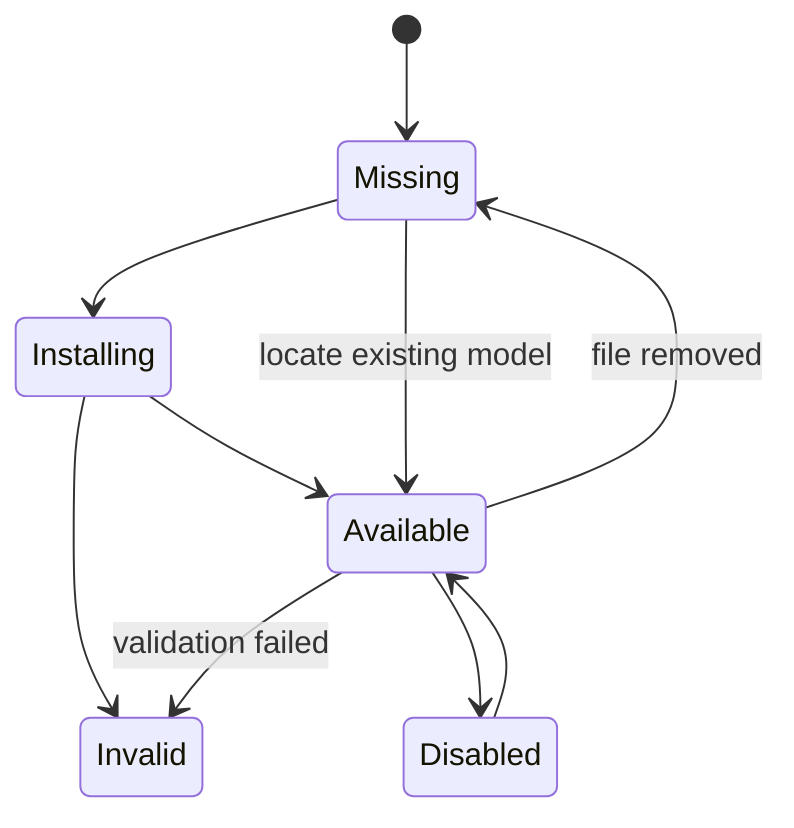

# RFC-012: Model Registry and Installation Workflow

**Project:** orbok  
**RFC:** 012  
**Title:** Model Registry and Installation Workflow  
**Status:** Implemented (v0.5.0)
**Target Milestone:** M12  
**Date:** 2026-06-06  

---

## 1. Summary

This RFC defines the local model registry and model installation/locate workflow for `orbok`.

The central decision is:

> Model management must be explicit, local-first, and compatibility-aware. Missing models must degrade features gracefully rather than blocking the application.

---

## 2. Motivation

`orbok` uses local AI models for semantic search and optional reranking.

Model handling affects:

- privacy expectations;
- disk usage;
- indexing compatibility;
- search availability;
- user trust;
- cross-platform packaging.

Users must understand whether a model is installed, what it is used for, where it is stored, and whether changing it requires reindexing.

---

## 3. Goals

- Maintain a local model registry.
- Support embedding and reranker models.
- Support locate-existing-model workflow.
- Support optional install workflow.
- Avoid silent model downloads.
- Track license summary and size.
- Track model compatibility with existing indexes.
- Degrade gracefully when models are missing.
- Warn when embedding model changes require reindexing.

---

## 4. Non-Goals

- This RFC does not choose final default models.
- This RFC does not implement hosted inference.
- This RFC does not define model fine-tuning.
- This RFC does not define secure model encryption.
- This RFC does not require bundling large models with the app.

---

## 5. Model Roles

Supported roles:

| Role | Purpose | Required? |
|---|---|---|
| embedding | semantic search | optional but central |
| reranker | deep result refinement | optional |

Keyword search must work without either model.

---

## 6. Model Registry Schema

RFC-002 defines `models`.

Required fields:

```text
model_id
role
model_name
model_version
model_family
local_path
license_summary
size_bytes
backend
dimension
status
created_at
updated_at
last_validated_at
```

Status values:

```text
available
missing
invalid
installing
disabled
```

---

## 7. Model State Machine



---

## 8. Model Setup UX

## 8.1. First Launch Model Check

```text
Local AI models

Semantic search requires a local embedding model.

Embedding model:
  Status: Missing
  Used for: Conceptual search

Reranker model:
  Status: Optional
  Used for: Deep result refinement

Choose setup:
  ( ) Locate models already on this computer
  ( ) Install recommended models
  ( ) Skip for now and use keyword search only
```

## 8.2. Models View

```text
Models
├── Embedding Model
│   ├── Status: Available / Missing / Invalid
│   ├── Size
│   ├── Backend
│   ├── Index compatibility
│   └── Actions: Validate, Locate, Remove, Disable
└── Reranker Model
    ├── Status
    ├── Optional label
    └── Actions
```

---

## 9. Installation Policy

Model installation must be explicit.

The UI must show:

- model name;
- role;
- download size;
- storage path;
- license summary;
- backend compatibility;
- whether documents are uploaded: no;
- whether model files are downloaded: yes.

User-facing copy:

```text
Installing a model downloads model files only.
Your documents are not uploaded.
```

---

## 10. Locate Existing Model

Users may choose a local model directory or file.

Backend validation must check:

- path exists;
- path is readable;
- model manifest or expected files exist;
- role is compatible;
- dimension matches registry metadata;
- backend can load it.

Do not trust frontend path directly. Apply backend path validation.

---

## 11. Compatibility Rules

## 11.1. Embedding Model Change

Changing embedding model invalidates semantic index.

Required behavior:

1. mark existing embeddings stale/incompatible;
2. keep keyword search active;
3. show rebuild-required warning;
4. queue reembedding when user confirms or automatic policy allows it.

UI copy:

```text
Changing the embedding model requires rebuilding the semantic search index.
Exact search will continue to work.
```

## 11.2. Reranker Model Change

Changing reranker model does not require reindexing.

Required behavior:

- invalidate rerank cache;
- keep keyword/vector indexes active.

---

## 12. Backend Abstraction

Model registry should not be tied to one inference backend.

Recommended traits:

```rust
pub trait ModelRegistry {
    fn list_models(&self) -> Result<Vec<ModelRecord>>;
    fn register_model(&self, input: RegisterModelInput) -> Result<ModelRecord>;
    fn validate_model(&self, model_id: &ModelId) -> Result<ModelValidation>;
    fn disable_model(&self, model_id: &ModelId) -> Result<()>;
}
```

---

## 13. Storage Accounting

Model files appear under:

```text
model_files
```

Model cache or per-model embedding bundles may appear under:

```text
vector_index
temporary_extraction
```

Do not mix model file size with generated embedding index size.

---

## 14. localcache Relationship

`localcache` may use model-specific namespaces for derived payloads.

Example:

```text
embedding-bundle:<model_id>:fp32:v1
```

When a model is removed or disabled, related localcache namespaces may become stale and should be eligible for cleanup.

The model registry remains in the `orbok` catalog, not localcache.

---

## 15. Security and Privacy

Models may be downloaded from external sources only with explicit consent.

Rules:

- no silent download;
- show model source;
- show license summary;
- verify file integrity where possible;
- do not upload documents for validation;
- do not log document text during validation;
- treat model path as local sensitive metadata.

---

## 16. Error States

| Error | UI Message |
|---|---|
| model_missing | Semantic search is unavailable until a local model is installed or located. |
| model_invalid | The selected model could not be validated. |
| backend_unavailable | This model requires a backend that is not available on this system. |
| dimension_mismatch | This model is incompatible with the current semantic index. |
| download_failed | Model download failed. You can retry or locate a local model. |

---

## 17. Acceptance Criteria

- Model registry lists embedding and reranker roles.
- App works in keyword-only mode with no models.
- User can locate an existing model.
- User can explicitly install a recommended model if supported.
- Model validation updates status.
- Embedding model change marks semantic index stale.
- Reranker model change invalidates rerank cache only.
- Model files appear in Storage view.
- No model download occurs silently.
- UI copy preserves local-first trust.

---

## 18. Testing Requirements

Required tests:

1. Missing embedding model disables semantic search cleanly.
2. Missing reranker disables deep refinement only.
3. Locate existing model succeeds with valid model path.
4. Invalid model path is rejected.
5. Embedding model change marks embeddings stale.
6. Reranker model change invalidates rerank cache.
7. Model removal does not delete source files or catalog.
8. Storage accounting separates model files from vector index.
9. Install workflow requires explicit confirmation.
10. Validation does not upload documents.

---

## 19. Unresolved Questions

- Which model format should be supported first?
- Should recommended models be bundled, downloaded, or manually located?
- Should checksums be mandatory for downloaded models?
- Should GPU backend availability be shown in Models view?
- Should multiple embedding models be supported simultaneously?

---

## 20. Decision

Implement explicit local model registry and setup workflow.

The application must remain useful in keyword-only mode when models are absent.
